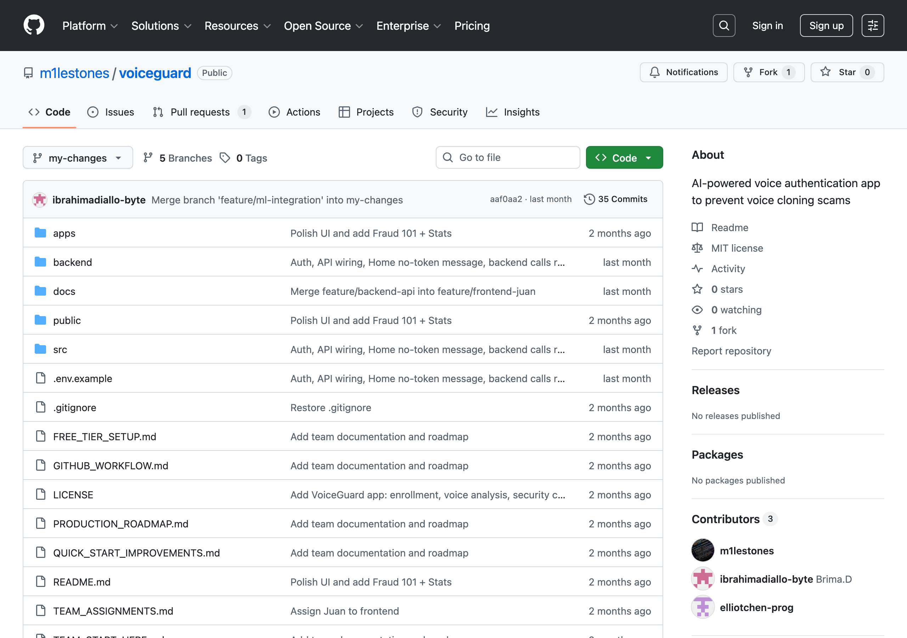
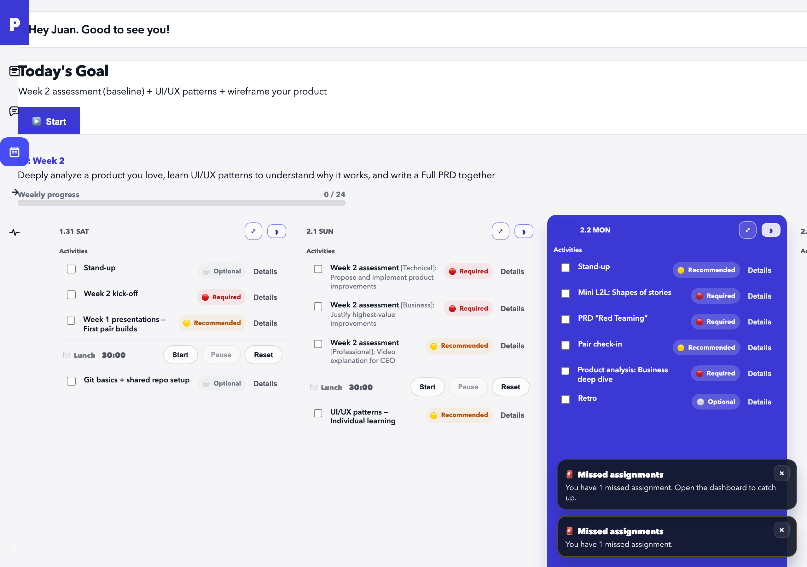
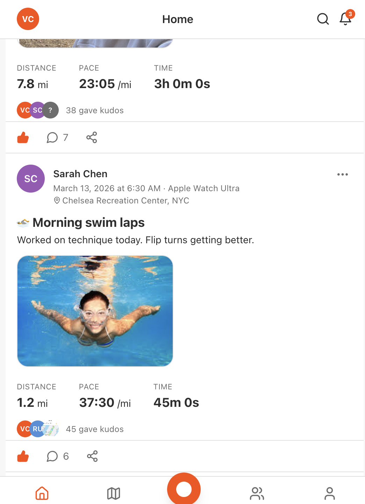
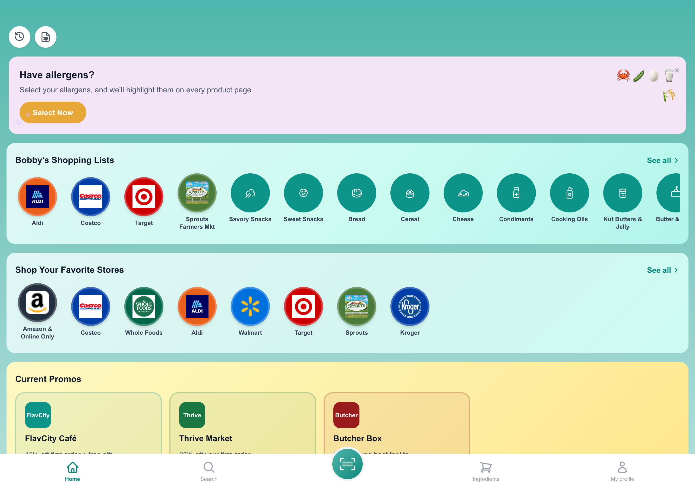
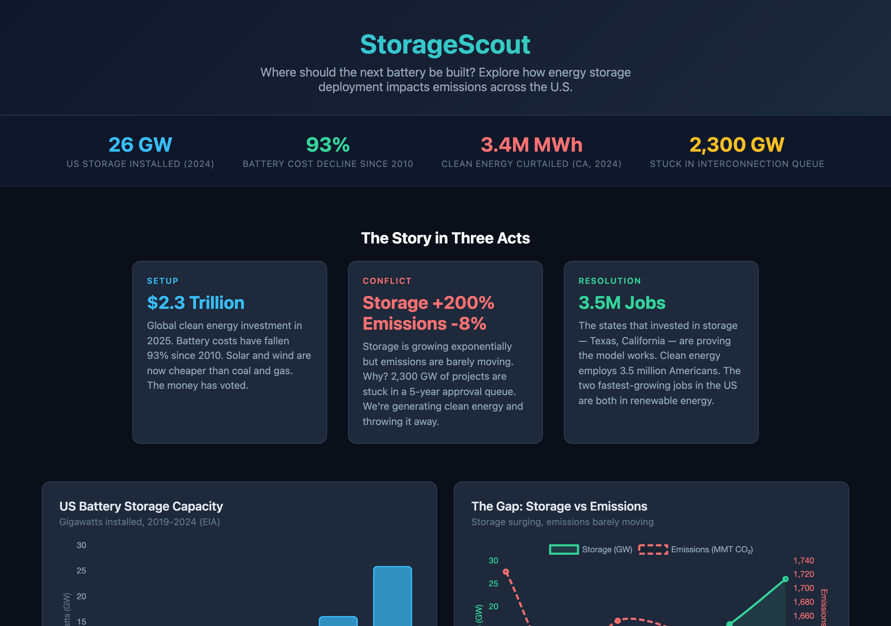
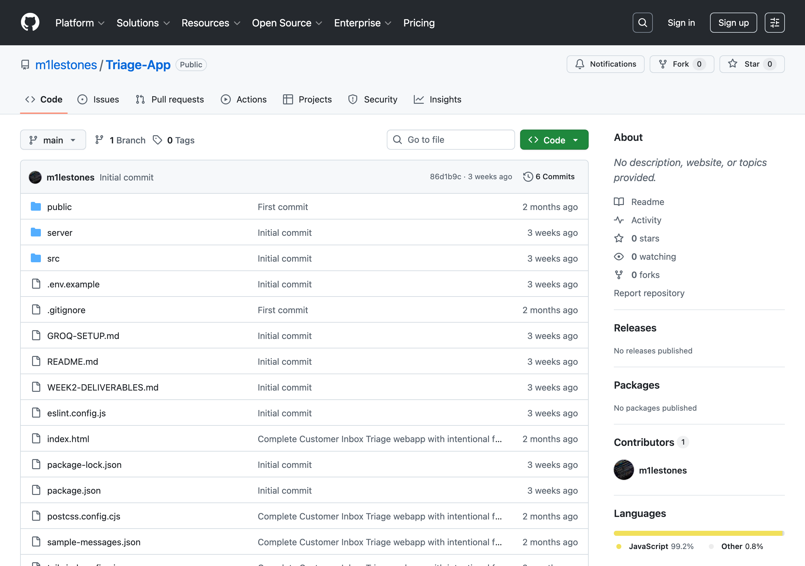
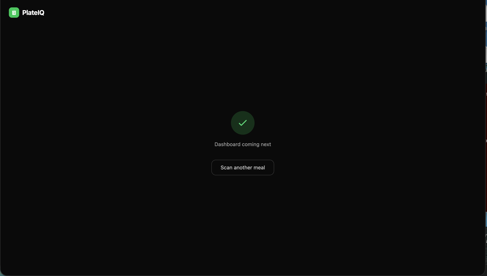

# pursuit-l2-portfolio-recap
Portfolio repo of all 4 L2 projects with strong READMEs
# 🚀 My L2 Portfolio — J. Franco | @m1lestones

> Software Engineering Fellow @ [Pursuit](https://www.pursuit.org/) · Long Island City, NYC

---

## 👋 About Me

I'm **Juan Franco**, a full-stack Software Engineering Fellow at Pursuit based in Queens, NYC. My path to software engineering is anything but conventional — I've spent 15+ years running **Primetime Recording Studio**, worked on avionics systems at **Panasonic Avionics**, and hold certifications in audio engineering and aeronautics technology.

That cross-domain background — aviation, music production, real estate, and now software — shapes how I approach building: with systems thinking, precision, and a deep belief that technology should solve real problems for real people.

I'm passionate about **blockchain & fintech** (XRP/XRPL, Solana, Base), **AI-powered applications**, and building tools that create access and opportunity. Currently deepening my expertise in full-stack development with a focus on landing a role at companies like Ripple or Coinbase.

📍 Queens, NY &nbsp;|&nbsp; 🎙️ Studio Owner &nbsp;|&nbsp; ✈️ Aviation Background &nbsp;|&nbsp; 🔗 Blockchain Enthusiast

---

## 🛠️ Tech Stack

**Frontend:** React, JavaScript (ES6+), HTML5, CSS3  
**Backend:** Node.js, Express, Python  
**Databases:** PostgreSQL, MongoDB, MySQL  
**Tools:** GitHub, VS Code, Cursor, Postman, Vercel  
**Exploring:** Solidity, XRPL SDK, Web3.js

---

## 📁 L2 Builds

### 1. 🛡️ VoiceGuard — AI Voice Cloning Detection

**Problem:** Scammers are using AI voice cloning technology to impersonate family members and phish money from vulnerable individuals. These synthetic voices can sound nearly identical to real people — even replicating emotional cues like crying — making it nearly impossible for victims to tell the difference.

**Solution:** VoiceGuard combines real-time voice analysis, biometric voice enrollment, and security-question verification to detect AI-cloned voices and prevent fraud before money is lost. Built with a web app + Expo mobile client and an Express backend.

**Tech:** React, Vite, Express, Expo (React Native), Node.js

**🔗 Repo:** [github.com/m1lestones/voiceguard](https://github.com/m1lestones/voiceguard)

---

### 2. 📋 Pursuit 2.1 — Collaborative L2 Project

**Problem:** Pursuit fellows rely on a student dashboard to track weekly curriculum activities, but the existing interface lacks prioritization cues, progress visibility, and quality-of-life features — making it easy to miss assignments and lose track of daily goals.

**Solution:** A PRD-driven replica of the Pursuit dashboard with priority tags (Required/Recommended/Optional), daily + weekly progress bars, a "next best action" button, lunch timer with notifications, missed-assignment alerts, day/night theme toggle, and swipe-based day navigation.

**Tech:** HTML5, CSS3, JavaScript, GitHub Pages, GitHub Actions (CI/CD)

**🔗 Repo:** [github.com/G3RRYGL3Z/Pursuit-2.1](https://github.com/G3RRYGL3Z/Pursuit-2.1)
**🌐 Live:** [g3rrygl3z.github.io/Pursuit-2.1](https://g3rrygl3z.github.io/Pursuit-2.1/)

---

### 3. 🏃 Strava Clone — Fitness Activity Tracker

**Problem:** Fitness enthusiasts need a centralized way to log workouts, track activity history, and visualize performance over time — but existing platforms can be bloated or inaccessible for users who just want a clean, focused tracker.

**Solution:** A full-stack Strava-inspired fitness tracking app that lets users log activities, view workout history with maps and photo feeds, and track performance stats through an intuitive UI built with modern frontend tooling and a robust data layer.

**Tech:** React, Vite, Tailwind CSS, JavaScript, PostCSS

**🔗 Repo:** [github.com/codingtemple17/strava_clone](https://github.com/codingtemple17/strava_clone)

---

### 4. 🥗 Bobby Approved — Ingredient Intelligence App

**Problem:** Consumers struggle to identify harmful additives hidden in food product ingredient lists. Reading labels is time-consuming, and most people don't know which ingredients to avoid — especially those with allergies, dietary restrictions, or health-conscious goals.

**Solution:** A mobile-first food product scanner that lets users scan barcodes, flag 33+ common processed additives (corn syrup, artificial colors, seed oils, etc.), check products against personal dietary profiles (allergies, vegan, keto), and get AI-powered ingredient explanations via OpenAI.

**Tech:** Next.js 16, React 19, TypeScript, Tailwind CSS, OpenAI API (gpt-4o-mini), html5-qrcode

**🔗 Repo:** [github.com/LubaKaper/bobby-approved-clone](https://github.com/LubaKaper/bobby-approved-clone)
**🌐 Live:** [bobby-approved-clone.vercel.app](https://bobby-approved-clone.vercel.app)

---

### 5. 📦 StorageScout — Storage Unit Finder

**Problem:** The U.S. has 2,300 GW of clean energy projects stuck in interconnection queues, and battery storage is growing exponentially — yet emissions are barely moving. Decision-makers lack accessible tools to explore where the next battery should be built and how storage deployment impacts emissions at the state level.

**Solution:** An interactive data dashboard that visualizes U.S. battery storage capacity, carbon intensity, and emissions trends. Features a real-time solar + carbon tracker, physics-informed carbon modeling, and a "what-if" simulator for storage deployment scenarios — powered by live data from WattTime, Electricity Maps, and Open-Meteo APIs.

**Tech:** React 19, TypeScript, Vite, Tailwind CSS, Express.js, WattTime API, Electricity Maps API, Vitest

**🔗 Repo:** [github.com/ismaelcaraballo-afk/storagescout](https://github.com/ismaelcaraballo-afk/storagescout)
**🌐 Live:** [ismaelcaraballo-afk.github.io/storagescout](https://ismaelcaraballo-afk.github.io/storagescout/)

---

### 6. 🚑 Triage App — Emergency Intake Tool

**Problem:** Support teams waste time manually reading and triaging customer messages. Without automated classification, high-urgency requests get buried, response times suffer, and routing decisions are inconsistent.

**Solution:** A lightweight AI-powered customer inbox triage tool that classifies support messages using Groq AI (Llama 3.3 70B), applies rule-based urgency scoring, and suggests next steps from predefined templates — giving teams an automated first pass at prioritization and routing.

**Tech:** React, Vite, Tailwind CSS, Groq API (Llama 3.3 70B), Node.js

**🔗 Repo:** [github.com/m1lestones/Triage-App](https://github.com/m1lestones/Triage-App)

---

### 7. 🍽️ PlateIQ — AI-Powered Food Wellness Dashboard

**Problem:** 55% of American calories come from ultra-processed foods, yet most nutrition apps only count calories. People lack an easy way to understand food *quality* — what they're actually eating and how it affects their health — without manual logging or complex databases.

**Solution:** An AI-powered food wellness dashboard that lets users snap or upload a meal photo to get instant nutrition breakdowns, NOVA processing classification (green → red scale showing how processed food is), and personalized wellness insights. Built with Claude Vision API for food identification and USDA FoodData Central for detailed nutrition data.

**Features:**
- 📸 Photo scanning via camera or upload
- 📊 Interactive nutrition dashboard (macros, micros, ingredient breakdown)
- 🎨 NOVA processing gauge (color-coded freshness scale)
- ⚖️ Real-time portion controls (S/M/L or custom grams)
- 🤖 AI wellness insights & food swap suggestions
- 🔌 Offline/demo mode with pre-cached meals

**Tech:** React 19, TypeScript, Vite, Tailwind CSS, Recharts, Claude Vision API, USDA FoodData Central API, CDC PLACES API

**🔗 Repo:** [github.com/m1lestones/Plate-IQ](https://github.com/m1lestones/Plate-IQ)
**🌐 Live:** [plate-iq.vercel.app](https://plate-iq.vercel.app/)

---

## 🔗 Connect With Me

---

*Built with 💪 through the [Pursuit Fellowship](https://www.pursuit.org/) — Long Island City, NYC*

